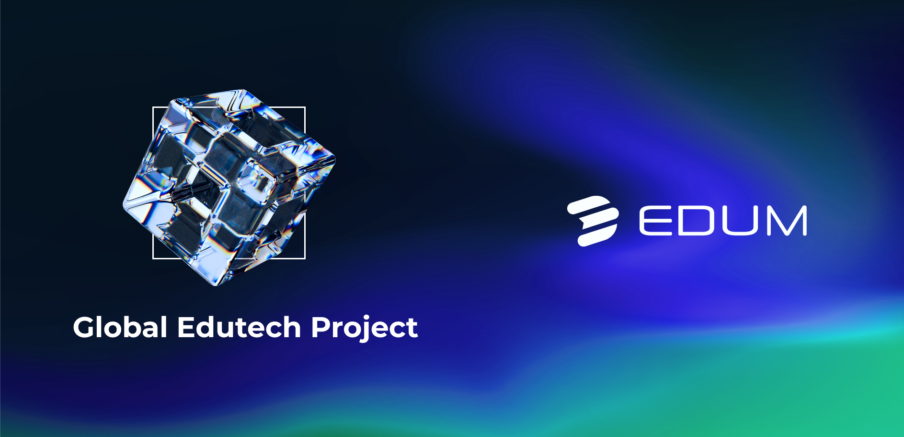
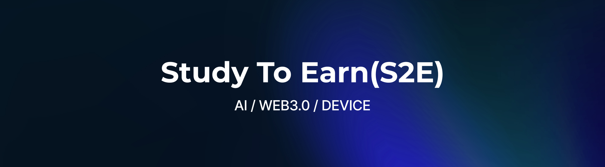

<!--
**edum-official/edum-official** is a ✨ _special_ ✨ repository because its `README.md` (this file) appears on your GitHub profile.

Here are some ideas to get you started:

- 🔭 I’m currently working on ...
- 🌱 I’m currently learning ...
- 👯 I’m looking to collaborate on ...
- 🤔 I’m looking for help with ...
- 💬 Ask me about ...
- 📫 How to reach me: ...
- 😄 Pronouns: ...
- ⚡ Fun fact: ...
-->

## EDUM 

## The "EDUM Project" (hereinafter referred to as Edum) is to create an educational ecosystem where participants can receive tangible rewards, ensuring that financial constraints do not force them to abandon their dreams. This ecosystem enables the participants to access high-quality educational services at reasonable costs and supports various scholarship programs to help individuals continue to pursue their aspirations.
### Through the innovative [reward, certification, intellectual property] systems in the education field, the Edum educational ecosystem empowers all participants, including learners, instructors, and service providers, to attain tangible economic value.

## Our Vision

#### “Never abandon your dreams due to financial limitations!”
 
## About EDUM
* [WEBPAGE 🎮] : https://edum.io/
* [WHITEPAPER-EN]📕 - https://dreamladders.gitbook.io/edu-metacore-whitepaper
* [WHITEPAPER-KR]📕 - https://dreamladders.gitbook.io/edu-metacore-whitepaper/v/1.6

## EDUM Social Media
* [TELEGRAM_Global] https://t.me/EDUMOfficial_global
* [TELEGRAM_Korea] https://t.me/EDUM_Official
* [MEDIUM] https://medium.com/@edum_official
* [TWITTER] https://x.com/EDUMOfficial

